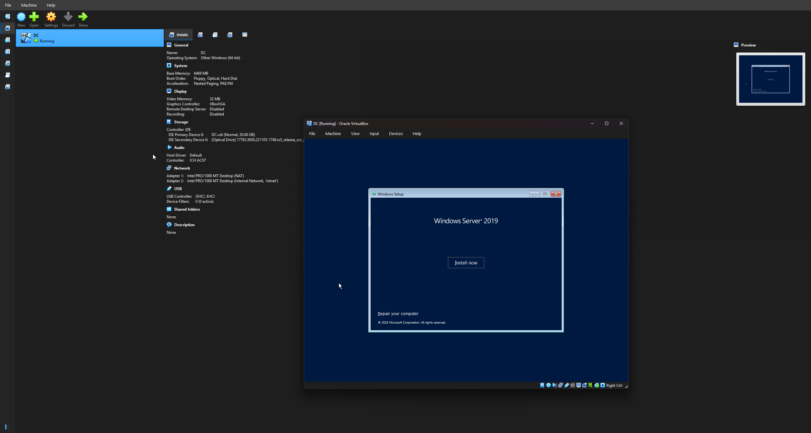
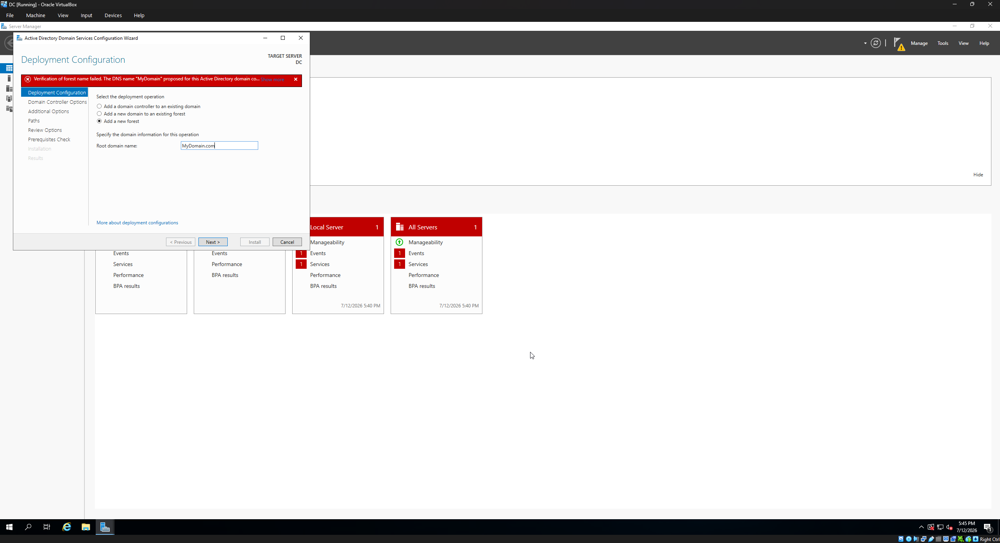
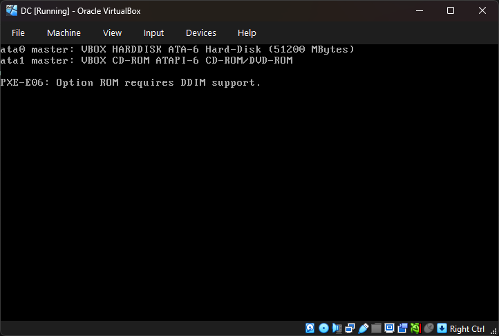
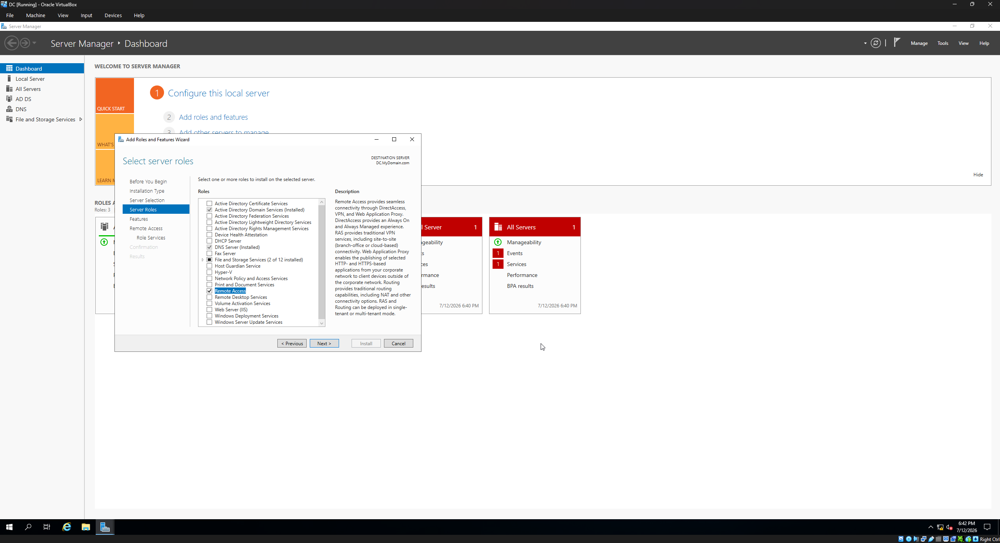

# Virtual Machine & Windows Server 2019 Active Directory & Windows 10 Client Home Lab

This repository documents the step-by-step deployment and configuration of a virtualized Windows Server 2019 Active Directory environment. The purpose of this lab is to build a secure, isolated private network that includes a fully functional Domain Controller (DC) capable of providing routing (NAT) and dynamic IP addressing (DHCP) to client machines.

## Lab Goals

- Build a Windows Server 2019 Domain Controller in VirtualBox
- Establish a secure isolated lab using VirtualBox internal networking
- Deploy Active Directory Domain Services and create the MyDomain.com forest
- Implement NAT routing and DHCP services to support client connectivity
- Automate bulk Active Directory user provisioning with PowerShell
- Provision and domain-join a Windows 10 Pro client machine
- Validate DHCP lease assignment, domain integration, and internet routing
- Document VM hardware allocations and network architecture

## Environment Architecture

- Hypervisor: Oracle VM VirtualBox
- Internal Network: VirtualBox Internal Network (`intnet`)
- DC VM: Windows Server 2019 with AD DS, DHCP Server, RRAS/NAT
- CLIENT1 VM: Windows 10 Pro client machine joined to MyDomain.com
- DC hardware allocation: 6 GB RAM, 2 CPU core, 50 GB storage
- CLIENT1 hardware allocation: 6 GB RAM, 2 CPU cores, 50 GB storage
- Network topology: `CLIENT1 -> intnet -> DC (NAT + DHCP) -> Internet`

## Deployment Checklist

### Phase 1: Virtual Machine Provisioning & Troubleshooting



- [x] Sourced the Windows Server 2019 ISO and staged deployment files
- [x] Created the DC virtual machine in VirtualBox
- [x] Attached the Server 2019 ISO to the secondary optical drive
- [x] Configured the primary network adapter to use Internal Network
- [x] Resolved initial BIOS/boot issues by enabling EFI support
- [x] Completed the base Windows Server 2019 installation
- [x] Initialized the local administrator credentials

### Phase 2: Post-Installation & Network Baseline

- [x] Assigned a static IP address and preferred DNS loopback to the internal interface
- [x] Renamed the system to DC and rebooted successfully

### Phase 3: Active Directory Domain Services Deployment



- [x] Installed the AD DS role via Server Manager
- [x] Promoted the server to a Domain Controller
- [x] Created a new forest with the root domain name MyDomain.com
- [x] Configured the Directory Services Restore Mode (DSRM) password
- [x] Verified the domain sign-in environment and login format

### Phase 4: Identity & Access Management Setup

- [x] Created an Organizational Unit (OU) named Admins in Active Directory Users and Computers
- [x] Created a dedicated user account inside the Admins OU
- [x] Added the account to the Domain Admins security group
- [x] Successfully signed in with the new dedicated domain admin account

### Phase 5: Routing, NAT, and DHCP Configuration

- [x] Installed the Remote Access role with Routing services
- [x] Configured Routing and Remote Access (RRAS) for NAT support
- [x] Installed and authorized the DHCP Server role
- [x] Configured an IPv4 DHCP scope with a default gateway and DNS server pointing to the DC


### Phase 6: Automated Bulk User Provisioning (PowerShell)

- [x] Sourced an open-source Active Directory bulk-user creation PowerShell script from Josh Madakor's GitHub repository
- [x] Downloaded the compressed ZIP file and extracted the script directory directly onto the DC desktop interface
- [x] Launched PowerShell ISE explicitly using the Run as Administrator privilege option
- [x] Opened the script file and executed `Set-ExecutionPolicy Unrestricted` to allow script playback
- [x] Modified the active directory pathway within the console and launched the script
- [x] Opened Active Directory Users and Computers (ADUC) to visually confirm that all automated user profiles were successfully generated inside the domain directory


### Phase 7: Windows 10 Client Provisioning & Hardware Baseline

- [x] Created a secondary virtual machine container in VirtualBox Manager using the performance specs outlined in the table below
- [x] Hardwired Network Adapter 1 directly to the identical Internal Network switch used by the Domain Controller
- [x] Mounted the Windows 10 installer ISO to the virtual optical drive and initiated system boot
- [x] Completed a clean installation of Windows 10 Pro, opting for the "limited experience" track during setup to bypass unnecessary cloud bloat
- [x] Opened the Command Prompt (`cmd`) on the workstation and verified the default gateway address pointed directly to the DC's static IP
- [x] Executed `ping www.google.com` inside the terminal and confirmed a perfect response (4 packets received, 0 lost)

| Virtual Machine Name | Operating System | Allocated Memory (RAM) | Processor Cores (CPU) | Storage Allocation | Network Mode |
| --- | --- | --- | --- | --- | --- |
| DC | Windows Server 2019 | 6 GB | 2 Core | 50.00 GB | Internal Network (`intnet`) |
| CLIENT1 | Windows 10 Pro | 6 GB | 2 Cores | 50.00 GB | Internal Network (`intnet`) |

### Phase 8: Domain Integration & Central Verification

- [x] Opened Advanced System Settings on the Windows 10 workstation and navigated to the Computer Name / Domain Changes window
- [x] Renamed the computer to CLIENT1 and changed the membership target from Workgroup to Domain: `MyDomain.com`
- [x] Authenticated the security handshake using the dedicated domain admin account credentials
- [x] Triggered a complete system restart on the client machine to apply network boundary updates
- [x] Swapped back to the DC Server VM to perform administrative verification checks
- [x] Opened the DHCP Server console and verified the active Address Leases log displayed CLIENT1 with its newly automated IP lease
- [x] Opened Active Directory Users and Computers to confirm CLIENT1 is formally registered as a trusted computer object inside the domain database

## Detailed Configuration Notes

### 1. Initial VM Setup & UEFI Troubleshooting

During the initial boot attempt, the VM failed to load the installation media and displayed the error:

> Option ROM requires DDIM support



Resolution:
1. Powered off the VM and opened VirtualBox Settings.
2. Navigated to System > Motherboard.
3. Enabled EFI support for the virtual machine.
4. Adjusted the boot order so the optical drive was prioritized ahead of the virtual hard disk.
5. Rebooted and completed the Windows Server installation successfully.

### 2. Network Interface Baseline & System Naming

Before promoting the server to a Domain Controller, the internal NIC was configured manually to avoid IP conflicts.

- IP Assignment: Static
- Preferred DNS: Local loopback / dedicated DC IP
- Computer Name: DC

### 3. Active Directory Installation & Domain Promotion



The Active Directory Domain Services role was added through Server Manager, and the server was promoted to a Domain Controller with the following settings:

- Deployment Operation: Add a new forest
- Root Domain Name: MyDomain.com
- DSRM Password: Configured and stored securely

### 4. Administrative Account Delegation

To follow least-privilege principles, the built-in administrator account was not used for day-to-day operations.

1. Open Active Directory Users and Computers (dsa.msc).
2. Create an OU named Admins.
3. Create a new user account inside that OU.
4. Add the account to the Domain Admins group from the Member Of tab.

### 5. Routing, NAT, and DHCP Setup

The Domain Controller was configured to act as a gateway for future client machines in the lab environment.

```text
[Internal Client VM] ---> [DC (NAT + DHCP Server)] ---> [External Internet]
```

- NAT: Enabled through Routing and Remote Access on the external interface
- DHCP: Configured with an IPv4 scope to automatically assign IP addresses to clients
- Default Gateway and DNS Server: Pointed to the DC's static IP address

### 6. Temporary PowerShell Execution Policy Change

To safely run the trusted bulk-user provisioning script in this isolated lab, the PowerShell execution policy was temporarily set to `Unrestricted`. This allows the script to execute while keeping the change limited to the lab environment and not recommended for production systems.

### 7. DNS, DHCP, and RRAS Validation

- Confirmed the DC is the authoritative DNS server for `MyDomain.com` and forwards unresolved queries to an external DNS resolver.
- Verified the DHCP scope includes the correct default gateway, DNS server address, and lease duration for lab clients.
- Checked RRAS interface bindings to ensure the internal adapter is used for client traffic and the external interface is used for NAT outbound routing.
- Ensured the DHCP lease list and the ADUC computer container both show `CLIENT1` as an active client object.

### 8. Client Integration Notes

- Client DNS must point to the DC to resolve domain services and complete the domain join.
- Domain join can fail if the client system time differs from the domain controller by more than 5 minutes, so time sync is important.
- After joining the domain, a reboot is required before domain credentials become available.

